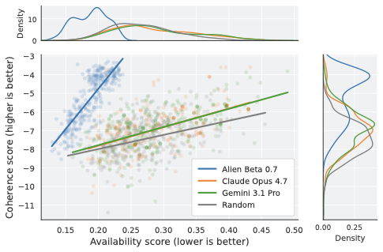

# The Alien Space of Science

Code and released artifacts for **"The Alien Space of Science: Sampling Coherent but Cognitively Unavailable Research Directions"**.

The paper studies a simple question: can we generate research directions that are internally coherent, but unlikely to be proposed by existing scientific communities? We represent papers as reusable **idea atoms**, learn which atom combinations are coherent, learn which combinations are already close to author communities, and sample the region that is coherent but cognitively unavailable to existing scientific communities.

**Figure 1:** [Alien Space of Science pipeline](figures/figure1.pdf)

## What This Repository Does

This repository has two stages:

- `atomization/`: provenance code for turning papers into idea atoms with LLM calls.
- `generation/`: the main reproduction path: train models, sample alien atom sets, and reconstruct them into research ideas.

Most users should download the OSF artifacts, use the released atom metadata and checkpoints, and reproduce the generation path without rerunning the expensive atomization stage.

**Note**: In our project, we just focus on papers in the LLM domain, as it is topically dense and methodologically diverse, yet bounded enough to approximate broad coverage. We believe our method could generalize to other domains.

OSF artifacts:
https://osf.io/huqfy/overview?view_only=962b19e17ccb4bb492b2501f0cf58763

## Core Idea

An atom set is scored by two official models:

- **Coherence model**: an autoregressive transformer over atom sequences. It assigns high score to atom combinations that look like plausible scientific methods.
- **Availability model**: a dual-encoder contrastive author/atom-set model. It assigns high availability to atom combinations close to existing author communities.

The sampler searches for atom sets that are coherent but unavailable:

```text
score(S) = (1 - beta) * z_coherence(S) + beta * z_unavailability(S)
```

where `z_unavailability` is the negated two-tower availability score.

<p align="center">
  
</p>

The blue region shows the intended target: samples that remain coherent while moving away from combinations already available to scientific communities.

## Setup

```bash
python -m venv .venv
source .venv/bin/activate
pip install -r requirements.txt
export PYTHONPATH=.
```

Set LiteLLM provider keys only for LLM-backed steps such as optional atomization or reconstruction:

```bash
export GEMINI_API_KEY=...
export ANTHROPIC_API_KEY=...
```

## Get Artifacts

Download the OSF artifacts and unpack them into the repository root. The expected layout is:

```text
papers/
  clusters.json
  clusters_80.json
  {paper_id}/blog.md
  {paper_id}/ideas.json
  {paper_id}/refined_ideas.json
data/
  llm-papers.db
  vocab.json
  coherence_dataset/
  availability_dataset/
models/
  coherence_model/
  availability_model/
```

`papers/clusters_80.json` is the recommended atom metadata for training and sampling, as it has approximately 3.5 atoms per paper. `papers/clusters.json` is the full clustering artifact before noise reassignment.

## Fast Path: Use Released Models

After unpacking the artifacts, generate ranked alien atom sets directly:

```bash
python alien.py sample \
  --coherence-model models/coherence_model \
  --availability-model models/availability_model \
  --token-mapping data/coherence_dataset/token_mapping.json \
  --output-dir results/beta_sweep \
  --ks 3 4 \
  --n-gen 100000 \
  --top-k 300
```

Outputs are written as per-`k`, per-`beta` result files under `results/beta_sweep/`. Each `results.json` can be passed to reconstruction.

## Reconstruct Ideas

To turn selected atom sets into readable methodology sketches:

```bash
python alien.py reconstruct \
  --method inference \
  --clusters papers/clusters_80.json \
  --results results/beta_sweep/k3/beta_0.7/results.json \
  --top-k 10 \
  --output-dir reconstructions
```

This step calls an LLM through LiteLLM.

## Retrain Models

Use the released pre-tokenized datasets to retrain the two official models:

```bash
python alien.py train-coherence \
  --train data/coherence_dataset/coherence_train.jsonl \
  --val data/coherence_dataset/coherence_val.jsonl \
  --token-mapping data/coherence_dataset/token_mapping.json \
  --output-dir models/coherence_model_retrained \
  --epochs 30

python alien.py train-availability \
  --train data/availability_dataset/availability_train.jsonl \
  --val data/availability_dataset/availability_val.jsonl \
  --token-mapping data/availability_dataset/token_mapping.json \
  --output-dir models/availability_model_retrained \
  --epochs 150
```

Then pass the retrained model directories to `python alien.py sample`.

## Rebuild Datasets

If you want to rebuild the JSONL datasets from the fixed atom metadata:

```bash
python alien.py make-datasets \
  --clusters papers/clusters_80.json \
  --vocab data/vocab.json \
  --length-balanced \
  --split 0.9 \
  --output-dir data/coherence_dataset_rebuilt

python alien.py make-availability \
  --clusters papers/clusters_80.json \
  --vocab data/vocab.json \
  --db data/llm-papers.db \
  --token-mapping data/coherence_dataset_rebuilt/token_mapping.json \
  --min-length 2 \
  --max-length 4 \
  --split 0.9 \
  --output-dir data/availability_dataset_rebuilt
```

The availability dataset uses the SQLite schema documented in `DATA.md`.

## Optional: Rerun Atomization

Most users should use the released `papers/` artifact. To rerun atomization from PDFs, prepare a TSV file:

```text
paper_id<TAB>pdf_url
```

Then run:

```bash
python alien.py atomize papers.tsv --output-dir papers
python alien.py cluster --papers-dir papers --output papers/clusters.json
```

This is slower and requires LLM provider keys. It is included for transparency and extension, not as the default reproduction path.

## Repository Map

```text
alien.py                  command dispatcher
atomization/              optional PDF -> atoms pipeline
generation/model.py       coherence autoregressive transformer
generation/two_tower_model.py
                          official two-tower availability model
generation/sample.py      alien atom-set sampler
generation/reconstruct.py LLM reconstruction from sampled atom sets
figures/                  paper and README figures
DATA.md                   artifact and schema contracts
```

## Notes

- Run commands from the repository root.
- `papers/`, `data/`, `models/`, `results/`, and `reconstructions/` are local artifacts and ignored by git.
